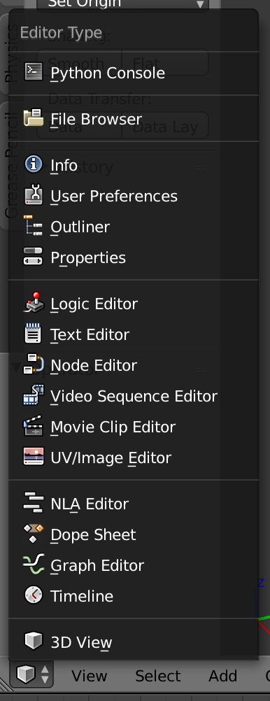

==========================
Previz :: Blender Plugin
==========================

**This README contains instructions for development of the Previz Blender plugin.**

If you're interested in simply using the Blender plugin, download `the lastest release <https://github.com/Previz-app/io_scene_previz/releases/tag/v1.2.2>`_.

---------------
Getting started
---------------
This README assumes that you have followed our general "getting started" instructions [#]_.

^^^^^^^^^^^^^^^^^^^^^^^^^^^^^^^^^^^^
Determine the correct Python version
^^^^^^^^^^^^^^^^^^^^^^^^^^^^^^^^^^^^
Before you begin, you **must** determine which version of Python Blender is using. If you install the incorrect version, nothing will work [#]_.

    The Blender editor menu

The simplest way to do that is to open Blender, and select "Python Console" from the "editor" menu (see screenshot).

^^^^^^^^^^^^^^^^^^^^^^^^^^
Install Python and friends
^^^^^^^^^^^^^^^^^^^^^^^^^^
`cd` to the project root, and run the following commands:

.. code-block:: sh

    # Install the correct version of Python
    $ pyenv install

    # Create a new virtual environment for the project dependencies
    $ pyenv virtualenv previz-blender

    # Ensure that the virtualenv is activated
    $ pyenv activate previz-blender

    # [Optional] Install your local development copy of the Python API client
    $ pip install -e /path/to/previz-python-api

    # Install the project dependencies
    $ pip install -r requirements.txt

^^^^^^^^^^^^^^^^^^^^^
"Register" the add-on
^^^^^^^^^^^^^^^^^^^^^
Now that everything is installed, you can symlink the ``io_scene_previz`` module into the Blender add-ons folder. Here's how to do that on macOS [#]_:

.. code-block:: sh

    # Safely create the add-on scripts directory
    $ mkdir -p ~/Library/Application\ Support/Blender/<blender-version>/scripts/addons

    # Symlink the module
    $ ln -s "$(pwd)/io_scene_previz" ~/Library/Application\ Support/Blender/<blender-version>/scripts/addons/

Refer to `the Blender path layout documentation <https://docs.blender.org/manual/en/dev/getting_started/installing/configuration/directories.html#path-layout>`_ for details on the correct path for your operating system.

^^^^^^^^^^^^^^^^^^^
Activate the add-on
^^^^^^^^^^^^^^^^^^^
Now it's time to activate the add-on within Blender.

Before you begin, ensure that you're using the correct virtual environment:

.. code-block:: sh

    $ pyenv activate previz-blender

Now you can launch Blender from the command line:

.. code-block:: sh

    # Linux (assuming you installed Blender using a package manager)
    $ blender

    # macOS (aliases are your friend)
    $ /Applications/Blender/blender.app/Contents/MacOS/blender

    # Windows
    $ cd c:\<blender installation directory>
    $ blender

Switch to the Blender application, and open "User Preferences". Select the "Add-ons" tab, and search for "Previz". Check the box to activate the add-on.

-------
Testing
-------
Before you can run the tests, you need to do a bit more set-up (this is in addition to the general `Getting Started`_ instructions).

^^^^^^^^^^^^^^^^^^^^^^^^
Add Blender to your path
^^^^^^^^^^^^^^^^^^^^^^^^
If you're running macOS, you need to add Blender to your path. Here's now to do that:

.. code-block:: sh

    $ export PATH="/Applications/Blender/blender.app/Contents/MacOS:$PATH"

^^^^^^^^^^^^^^^^^^^^^^^^^^^^^^^^
Activate the virtual environment
^^^^^^^^^^^^^^^^^^^^^^^^^^^^^^^^
As ever, you must ensure that everything run from within your ``previz-blender`` virtual environment:

.. code-block:: sh

    $ pyenv activate previz-blender

If you forget to do this, the test suite with helpfully inform you of your error.

^^^^^^^^^^^^^^^^^^^^^^^^^^^^^
Set the environment variables
^^^^^^^^^^^^^^^^^^^^^^^^^^^^^
The test suite depends on a number of environment variables. Configure them as follows:

1. Copy ``tests/.env.example``, and name it ``tests/.env``.
2. Set the variable values in your new ``.env`` file. Each variable is clearly documented.

Once again, if you forget to set your environment variables, the test suite will display an informative error message.

----

-------
Building a Release 
-------

`setup.py` defines a `bdist_blender_addon` command that build an addon archive in the `dist` directory.

.. code-block:: sh
    # Build from a clean virtual env
    $ pyvenv-3.5 env
    $ source env/bin/activate

    # Install the dependencies
    (env) $ pip install -r requirements.txt

    # Run [bumpversion](https://github.com/peritus/bumpversion) to update release version
    # This will add a new git tag and will commit the new version
    # Version types are: major, minor, patch
    (env) $ bumpversion patch

    # Build the addon archive
    (env) $ python setup.py bdist_blender_addon
    (env) $ ls dist

---

.. [#] In summary, you should be using `pyenv` to manage your Python versions, and `pyenv-virtualenv` to manage your project dependencies.
.. [#] You can get away with a different patch number, as long as the major and minor version numbers are correct
.. [#] Replacing ``<blender-version>`` with the appropriate version number, obviously.